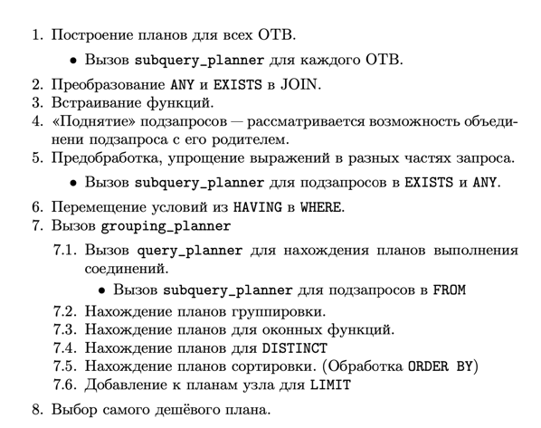

# Как работает планировщик в postgres

## Table of contents
1. [General words](#general-words)
2. [The order of execution](#the-order-of-execution)

### General words
В PostgreSQL нет чёткого разделения на оптимизатор и планировщик. По сути, это один компонент, который переписывает запрос и тут же строит план его выполнения. 
В дальнейшем, мы будем называть этот компонент оптимизатором.
На вход оптимизатору приходит дерево запроса, прошедшее семантический анализ и представляющее собой логический план выполнения запроса. 
На выходе получается физический план, который также явля- ется деревом.
Процесс планирования выполняется одним потоком. Оптимизатор рекурсивно обрабатывает подзапросы, строя план «cнизу-вверх». 
Упрощённая последовательность действий, выполняемая оптимизатором, представлена в Таблице 2. 

При нахождении планов для каждого отношения, как исходного, так и того, которое встречается в качестве промежуточного 
результата при выполнении запроса, оптимизатор сохраняет несколько планов. 
Планы идентифицируются ключами (структура PathKey), которые содержат информацию о порядке записей, получаемом при выполнении данного плана. 
При добавлении очередного плана в список планов для текущего отношения, он сравнивается с другим планом с таким же ключём. 
Если такой план имеется и его стоимость ниже, то новый план отбрасывается, а иначе новый план заменяет старый.

### The order of execution
Перед началом оптимизации, запрос в PostgreSQL проходит несколько этапов:
1. Лексический анализ PostgreSQL определяет, какие символы представляют лексемы (ключевые слова, имена таблиц, операторы и т.д.) в запросе.
2. Синтаксический анализ PostgreSQL проверяет грамматическую корректность запроса и формирует древовидную структуру для дальнейшей обработки.
3. Алгебраические преобразования PostgreSQL применяет преобразования запроса с целью упрощения выражений, устранения избыточности и анализа выражений.
4. Оптимизация PostgreSQL формирует несколько возможных планов выполнения запроса (планировщик) и выбирает наилучший план на основе статистической информации о данных (в том числе, о распределении значений в столбцах таблиц), настройках конфигурации PostgreSQL и других факторах.
5. Генерация кода PostgreSQL формирует инструкции для выполнения запроса и передает их в экзекутор, который затем выполняет эти инструкции для получения результата.
   (https://habr.com/ru/companies/postgrespro/articles/574702/)

### Official documentation
Сначала планировщик/оптимизатор вырабатывает планы для сканирования каждого отдельного отношения (таблицы), используемого в запросе. 
Множество возможных планов определяется в зависимости от наличия индексов в каждом отношении. 
Произвести последовательное сканирование отношения можно в любом случае, так что план последовательного сканирования создаётся всегда. 
Предположим, что для отношения создан индекс (например, индекс-B-дерево) и запрос содержит ограничение отношение.атрибут ОПЕР константа. 
Если окажется, что отношение.атрибут совпадает с ключом индекса-B-дерева и ОПЕР — один из операторов, входящих в класс операторов индекса, 
создаётся ещё один план, c использованием индекса-B-дерева для чтения отношения. 
Если находятся другие индексы, ключи которых соответствуют ограничениям запроса, могут добавиться и другие планы. 
Планы сканирования индекса также создаются для индексов, если их порядок сортировки соответствует предложению ORDER BY (если оно есть), 
или этот порядок может быть полезен для соединения слиянием (см. ниже).

Если в запросе требуется соединить два или несколько отношений, после того, как будут определены все подходящие планы 
сканирования отдельных отношений, рассматриваются планы соединения. При этом возможны три стратегии соединения:

- Cоединение с вложенным циклом: Правое отношение сканируется один раз для каждой строки, найденной в левом отношении. Эту стратегию легко реализовать, но она может быть очень трудоёмкой. (Однако если правое отношение можно сканировать по индексу, эта стратегия может быть удачной. Тогда значения из текущей строки левого отношения могут использоваться как ключи для сканирования по индексу справа.)

- Cоединение слиянием: Каждое отношение сортируется по атрибутам соединения до начала соединения. Затем два отношения сканируются параллельно и соответствующие строки, объединяясь, формируют строки соединения. Этот тип соединения более привлекательный, так как каждое отношение сканируется только один раз. Требуемый порядок сортировки можно получить, либо добавив явный этап сортировки, либо просканировав отношение в нужном порядке, используя индекс по ключу соединения.

- Cоединение по хешу: сначала сканируется правое отношение и формируется хеш-таблица, ключ в которой вычисляется по атрибутам соединения. Затем сканируется левое отношение и по тем же атрибутам в каждой строке вычисляется ключ для поиска в этой хеш-таблице соответствующих строк справа.

Когда в запросе задействованы более двух отношений, окончательный результат должен быть получен из дерева с узлами соединения, имеющими по два входа. 
Планировщик рассматривает все возможные последовательности соединения и выбирает самую выгодную.

Если число задействованных в запросе отношений меньше geqo_threshold, для поиска оптимальной последовательности соединений производится практически полный перебор. 
Планировщик отдаёт предпочтение соединениям между двумя отношениями, для которых есть соответствующее
предложение соединения в условии WHERE (то есть, для которых находится ограничение вида where табл1.атр1=табл2.атр2). 
Пары соединения без подобного предложения рассматриваются, только если нет другого выбора, то есть когда для определённого отношения не находятся предложения соединения с каким-либо другим отношением. 
Планировщик рассматривает все возможные планы для каждой пары соединения и выбирает самый выгодный из них (по его оценке).

Если geqo_threshold превышается, последовательность соединений выбирается эвристическим путём, как описано в Главе 58. 
В остальном процесс планирования тот же.

Законченное дерево плана содержит узлы сканирования по индексу или последовательного сканирования базовых отношений, 
плюс узлы соединения с вложенным циклом, соединения слиянием или соединения по хешу (если требуется), плюс, возможно, 
узлы дополнительных действий, например, сортировки или вычисления агрегатных функций. 
Большинство из этих узлов могут дополнительно производить отбор (отбрасывать строки, не удовлетворяющие заданному логическому условию) 
и расчёты (вычислять производный набор столбцов по значениям заданных столбцов, то есть вычислять скалярные выражения). 
Одна из задач планировщика — добавить условия отбора из предложения WHERE и вычисления требуемых выходных выражений к наиболее 
подходящим узлам дерева плана.